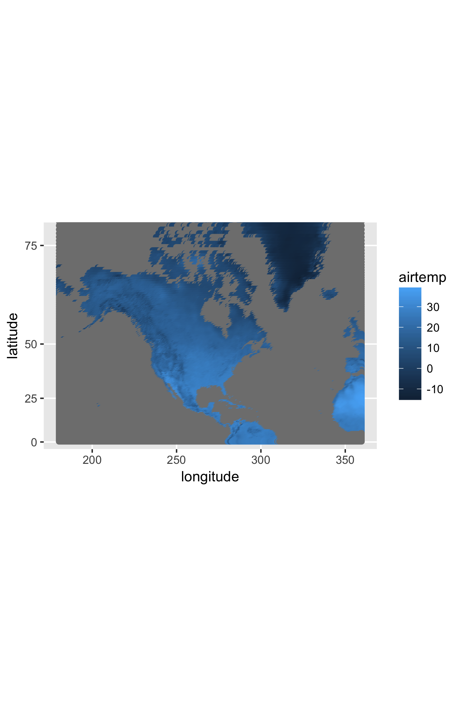
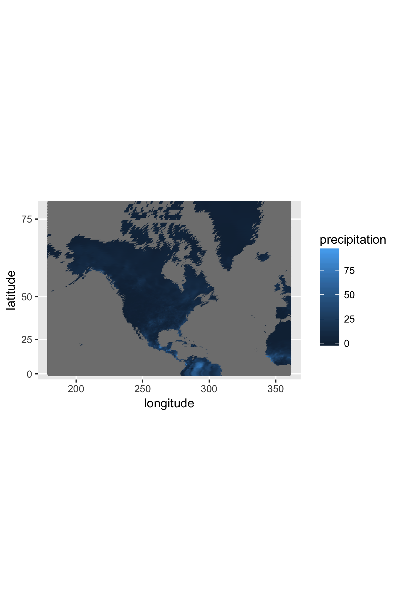

# Climate Report

## North American Temperature and Precipitation, 1960-2014

### Temperature

The temperature pattern looks reasonable because it is colder with higher latitude. There's no major differences between years.

### Precipitation

The temperature pattern looks reasonable because there's more precipitation around tropical area in lower latitude. There's slightly more precipitation in recent years.

### Note:

you cannot do any conclusions about long-term trend based on just 3
figures.  If you are interested, you are welcome to explore long-term
trends in these data, but be sure to use more suitable methods.
